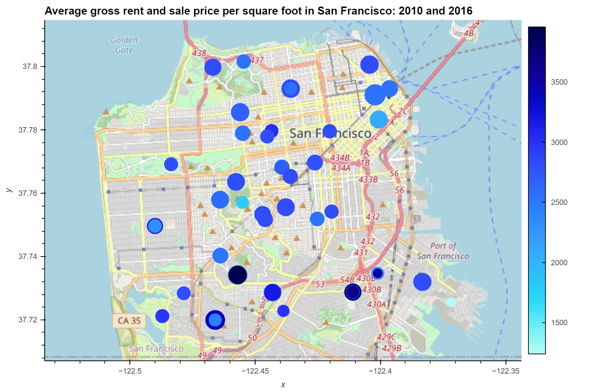

# San Francisco Housing and rental Analysis

An Analysis of San Francisco Housing Statistics from 2010 to 2016 using aggregation, interactive visualizations, and geospatial analysis to determine viable investment opportunities.

